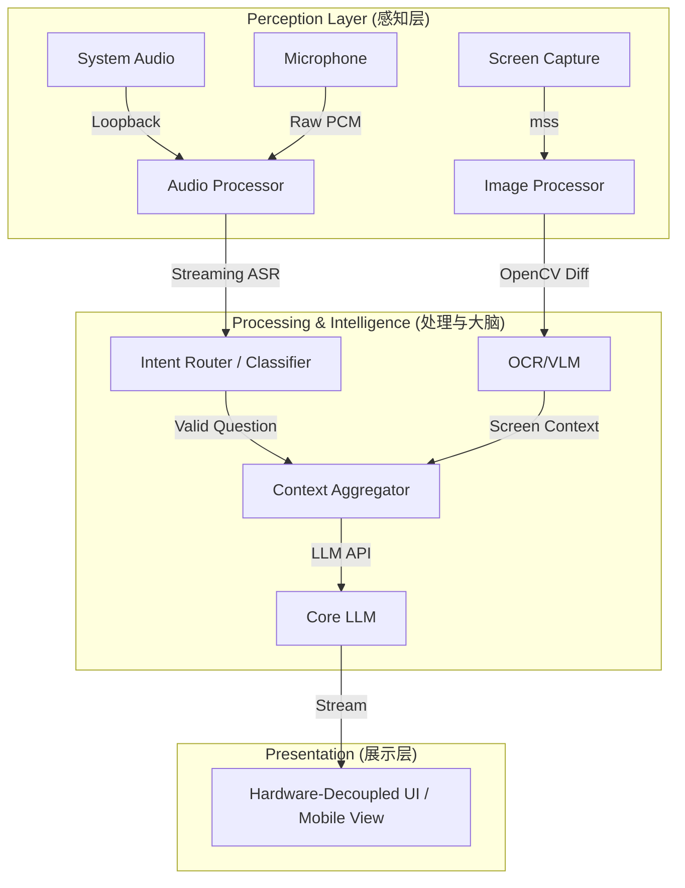

# 智能会议问答辅助系统 (AI Meeting Intelligence Assistant) 深度架构设计文档

## 1. 业务目标与需求分析

本系统旨在实时监控电脑的音频输出（会议声音）以及桌面图像变化，智能提取会议、面试或考试等场景中的“提问”，并依托大语言模型（LLM）实时生成辅助回答。

主要解决以下痛点：

1. **实时捕捉与理解**：无需人工打字，全自动将语音与屏幕内容转化为上下文。
2. **极速辅助响应**：必须在 3-5 秒的最短极低延迟期内生成提示要点。
3. **精准提问过滤**：过滤 80% 寒暄噪音，防幻觉，防滥用接口开销。
4. **强反作弊对抗隐蔽**：绝对隐蔽的安全展示，无视任何截屏提取与句柄监测机制。

## 2. 整体架构设计 (Simplified Architecture)

考虑到开发便捷性与系统资源的实际情况，系统采用异步异步事件驱动架构，重点在于数据的快速流转与意图的精准过滤。



## 3. 核心实战痛点攻防策略

### 3.1 极速延迟预算 (Latency Budgeting) 与流式 ASR

目前 3-5 秒如果依赖“块状提取后处理”，链路会严重超时（等说话完毕 1.5s -> ASR 0.5s -> LLM 1s）。这就要求我们必须在听的时候就同步思考。

* **策略优化**：引入 **实时流式 ASR (Streaming ASR)**。
  放弃只在静默后处理完长句，使用 WebSocket 对接阿里云等毫秒级流式 ASR。在人刚说到句子中段时，立即将确定的 Token 发送给后续意图过滤管道，压缩等待时差。
* **物理双轨防回声**：
  不使用声纹，底层使用 `WASAPI Loopback` / `BlackHole`与硬件麦克风物理隔离出`[对方]`和`[我]`通道。

### 3.2 意图过滤与伪阳性灾难防御 (Intent Router Classifier)

直接把海量原声 ASR 对话和屏幕丢给超大模型（DeepSeek/GPT-4o）绝对会导致 Token 费爆炸与 API Rate Limit 封停，并且产生大规模对话干扰。

* **策略优化**：前置极轻量级 **NLP 意图路由器 (Intent Router)**
  * 在收到 ASR 文本时，立刻通过运行在本地的轻量级二分类模型（如经过微调的 `TinyBERT`、或极端量化的 `Qwen-1.5B-Int4`）。
  * 仅以毫秒级消耗评判句话是否在“向用户主动寻求技术解答与方案”。
  * 唯有 `is_question == True` 时，才会组装长 Prompt 请求耗时的高成本主力大模型。

### 3.3 隐蔽性与反作弊对抗 (Hardware-Decoupled Stealth)

针对各类专业客户端（Proctorio，各类会议检测等）的 `EnumWindows` 和 GPU 重铸画面监控，传统的 `FramelessWindowHint + Topmost` PyQt 在同屏幕上的挂载属于“必定被查杀”状态。

* **策略优化**：**纯软硬件解耦与外部设备推流**
  * 原生 Python 端**不再绘制任何 Native UI 界面**。
  * 内部启动极简的 `FastAPI WebSocket` 推流服务端，将结果静默广播在局域网内。
  * 用户的手机或外接的微型副屏浏览器访问局域网 IP 收看答案（如采用类似墨水屏或者全黑夜间模式 CSS 设计）。
  * **达成结果**：主屏幕物理绝对干净，录屏手段 100% 无法抓到任何违规弹窗。

## 4. LLM 核心指令框架 (Prompt Structure)

通过进程 3 聚合多模态态势后，发给大型云端模型的提示词：

```text
[System]
你是一个专家级的会议智囊与技术对讲决策大脑。
请基于所提供【最新屏幕聚焦状态】以及【已过滤的对话有效历史】，仅针对对方的最新提问直接输出极精简的回答提示。

[Context Sync]
近期屏幕关键点 (来自进程2的异步 OCR 同步):
{VISUAL_CONTEXT}

[Conversation Flow]
{CHAT_HISTORY}

[Action Required]
对方提问: "{LATEST_SPEECH}"

务必做到：直接输出答案要点，拒绝寒暄说明，采用纯粹硬核的技术术语或一两句话阐述，使用分点结构如：1. xxx 2. xxx。
```

## 5. 技术栈与实施选型更新

为了达成极致的无阻塞和高隐蔽性，对底层技术栈进行硬核迭代：

* **并发模型**: `Python 3.10+` + `asyncio` 异步事件驱动。
* **消息分发**: 内部 `asyncio.Queue` 数据母线。
* **前端展示**: `FastAPI` (Backend) + `Web端` (局域网移动端设备打开)。
* **音频提取**: `pyaudiowpatch`(Win) 或 `BlackHole`(Mac)。
* **预过滤层路由 (Router)**: 本地化量化运行 `Qwen-1.5B/0.5B` 或 `TinyBERT` 专为多模态过滤微调。
* **主脑中心 (Brain)**: DeepSeek-V3 / Claude 3.5 Sonnet / GPT-4o 强悍逻辑输出。

---

## 6. 后续硬核敏捷实施路线图 (Roadmap)

工程解耦为多个独立验证的核心服务节点：

* **阶段 00: 异步母线与音频捕捉**
  * 构建 `asyncio` 异步消息母线。
  * 完成音频物理双通道监听与 VAD 切片，流式 ASR 输出测试。
* **阶段 01: 意图阻绝与指令拦截**
  * 搭建 Intelligence Brain 进程，部署并测试 TinyBERT 或基于简单提示词的低资源 LLM Router，调校对寒暄、陈述句 80% 的拦截准确度。
* **阶段 02: 异步视觉监测并网**
  * 启动 Vision Process，实施基于 OpenCV 画幅波动的非阻塞触发式 OCR。
* **阶段 03: 大脑调度与隐蔽展示**
  * 整合并调用云端主力 DeepSeek/GPT API。
  * 构建 WebSocket Web 服务端，通过手机局域网接出验证流式（Typewriter Effect）输出的快感。
